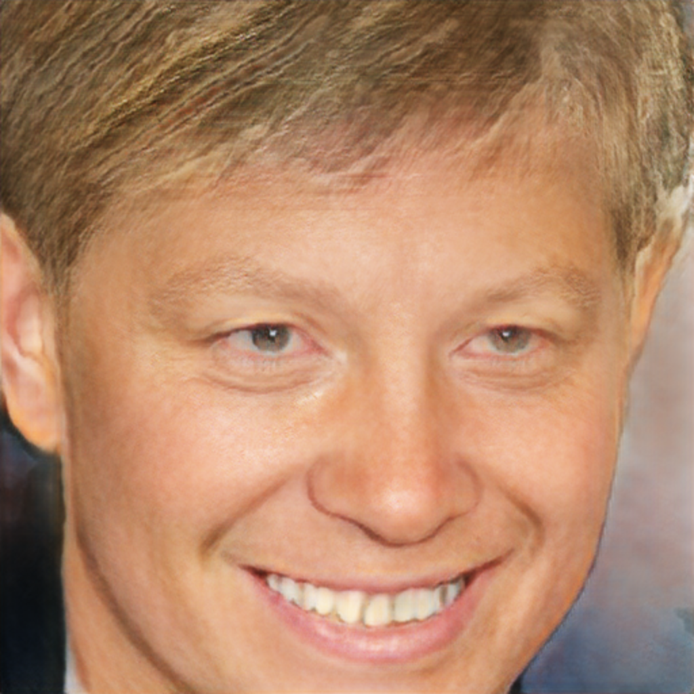
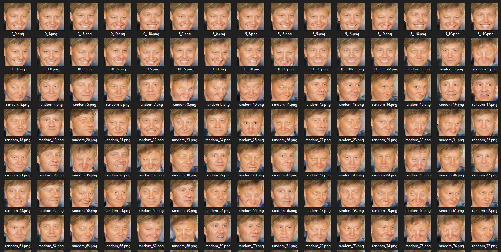

# MALIVAR-ML-Engineer-Test
Тестовое задание посвященное генерации лица с выбранными параметрами с возможностью дальнейшего редактирования.

# Задача
Задача состоит из двух частей:

1. Генерация несуществующего человека с возможностью редактирования лица.
Скрипт с множеством гиперпараметров или окно с элементами управления.
2. Скрипт, который генерирует изображения ранее сгенерированного человека (головы) с комбинацией различных вращений и выражений лица.

### В данной работе использовались
* Nvidea GeForce 960 4Gb VRAM
* Python 3.6
* CUDA 10.1
* cuDNN v7.6.5
# 1 часть задания
Для выполнения первой части задания был найден и изучен open-source проект __TL-GAN: transparent latent-space GAN__ (https://github.com/SummitKwan/transparent_latent_gan)

## Установка и запуск
### Создание виртуального окружения для данной части задания  
```
    > python -m venv venvtlgan

    > venvtlgan\Scripts\activate
```
### Установка зависимостей и запуск  
1. ```cd``` (в корневую директорию проекта).  

```
    > cd transparent_latent_gan  

    > pip install -r requirements.txt
```
2. Вручную загрузите предварительно обученную модель pg-GAN из [dropbox](https://www.dropbox.com/sh/y1ryg8iq1erfcsr/AAB--PO5qAapwp8ILcgxE2I6a?dl=0).
3. Распакуйте загруженные файлы и поместите их в каталог проекта в следующем формате
```
root
    asset_model
        karras2018iclr-celebahq-1024x1024.pkl
        cnn_face_attr_celeba
            model_20180927_032934.h5
    asset_results
        pg_gan_celeba_feature_direction_40
            feature_direction_20181002_044444.pkl
    src
        ...
    static
        ...
    ...
```
4. Запустите jupyter ноутбук (потребуется загрузить соответствующую библиотеку) из ```./src/notebooks/tl_gan_ipywidgets_gui.ipynb``` 
5. В GUI можно настроить лицо несуществующего человека с выбранными параметрами  для использования изображения во второй части задания и сохранить в ```<корневой каталог репозитория>\img\test.png```, которая находится в корневой папке репозитория.

### Пример работы  
      
  
Данный проект был расширен только путем добавления кнопки _Save image_ для дальнейшего использования.

# 2 часть задания
Во второй части задания использовался open-source проект __CONFIG: Controllable Neural Face Image Generation__ (https://arxiv.org/pdf/2005.02671.pdf) (https://github.com/microsoft/ConfigNet)

## Установка
### Создание виртуального окружения для 2-ой части задания  
Перед данным действием требуется покинуть виртуальное окружение 1-ого задания.
```
    > python -m venv venvconfignet

     venvconfignet\Scripts\activate
```
### Установка зависимостей и вспомогательных компонентов
1. ```cd``` (в корневую директорию проекта).  
```
    > pip install -r setup/requirements.txt
```
2. Если вы используете Windows, загрузите и настройте OpenFace автоматически, запустив 
```
    > python setup/download_deps.py
```
3. Если вы используете другие ОС, вам нужно будет установить OpenFace в соответствии с [инструкциями](https://github.com/TadasBaltrusaitis/OpenFace/wiki/Unix-Installation), вам также нужно будет указать путь к OpenFace в ```confignet/face_image_normalizer.py```
4. Загрузите файл [model.zip](https://github.com/microsoft/ConfigNet/releases/download/v1.0.0/models.zip), содержащий предварительно обученные модели, и извлеките его в корневой каталог репозитория.
5. Также потребуется загрузить модель повышения разрешения __Single Image Super-Resolution with EDSR, WDSR and SRGAN__ (https://github.com/krasserm/super-resolution). Для этого следует загрузить [предварительно обученные веса](https://martin-krasser.de/sisr/weights-srgan.tar.gz) и распаковать в папку ```evaluation\```
## Запуск
```
    > python evaluation/generate_dataset_my.py --image_path <путь к изображению> --max_angle <угол отклонения лица> --enable_sr <применить/отключить S-R>
```
1. <путь к изображению> - путь к сгенерированному изображению в предыдущем задании. Должен оканчиваться на ```...<корневой каталог репозитория>\img\test.png```
2. <угол отклонения лица> - под углом подразумевается число, которое задает диапазон поворота головы. Например ```--max_angle 60 ``` позволит сгенерировать датасет, в котором рысканье и тангаж будут изменяться от -60 до 60 градусов с шагом 5.
3. <применить/отключить S-R> - позволяет включить/отключить применение Super-Resolution к выходным изображениям. 1 - включить, 0 - отключить. В случае отключенного режима, выходное изображение также будет с разрешением 1024х1024, однако вместо S-R будет применен метод билинейной интерполяции для увеличения расширения картинки (ConfigNet на выходе выдает разрешение 512х512 или 256х256). Также S-R выполняется полностью на CPU, что замедлит генерацию датасета.  

Данная команда сгенерирует в папке ```<корневой каталог репозитория>/dataset/``` изображения сгенерированного лица в 1-ом задании с поворотами от -60 до 60 градусов, затем со случайными поворотами лица, глаз и различными эмоциями (100 изображений) с применением S-R.
```
    > python evaluation/generate_dataset_my.py --image_path <путь к изображению>
```

## Пример работы
Из данной картинки после отработки скрипта был получен датасет с различными поворотами и выражениями лица.

Собственно датасет
